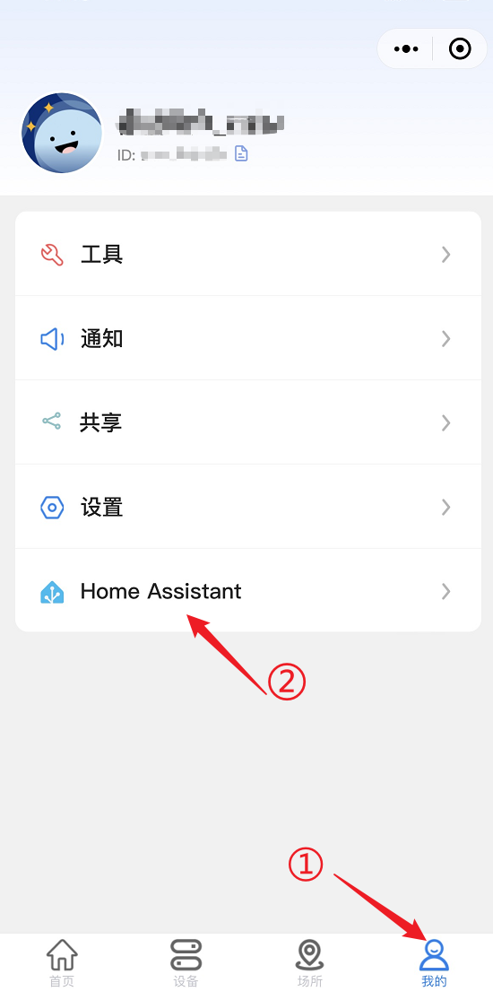
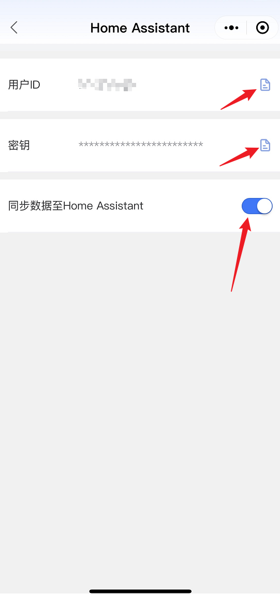
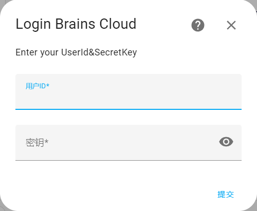

一个用于 Home Assistant 的自定义集成，适用于博瑞思智能设备。

### 支持的设备

- 全屋智能多路电表

### 安装：

#### 方式一（HACS）

如果您的Home Assistant已经安装了HACS插件商店，则只需要在商店中搜索`brains`并安装即可

#### 方式二（manual）

对于手动安装，请将 `brains`文件夹及其所有内容复制到你的 Home Assistant 的 custom_components 文件夹中。这个文件夹通常位于你的 `/config` 文件夹内。如果你使用的是 Hass.io，可以使用 SAMBA 将文件夹复制过去。如果你使用的是 Home Assistant Supervised，custom_components 文件夹可能位于 `/usr/share/hassio/homeassistant`。你可能需要创建 `custom_components` 文件夹，然后将 `brains`文件夹及其所有内容复制到其中。

### 使用

#### 步骤一

首先您需要登录到微信小程序获取用户ID以及密钥

#### 步骤二

获取到用户ID以及密钥后在HA中打开集成，输入ID和密钥后即可将设备数据同步至Home Assistant

